<p align="center">
  <picture>
    <source media="(prefers-color-scheme: dark)" srcset="src/main/resources/static/images/logo/logo-with-tagline-white.png"/>
    <source media="(prefers-color-scheme: light)" srcset="src/main/resources/static/images/logo/logo-with-tagline.png"/>
    
  </picture>
</p>

<h1 align="center">VNRailway</h1>

<p align="center">
  A server-rendered railway ticketing and operations platform, built to keep every domain rule<br/>
  correct even under concurrent, high-contention database access.
</p>

<p align="center">
  <a href="https://vnrailway.onrender.com"></a>
</p>

<p align="center">
  
  
  
  
  
  
  
  
</p>

<p align="center">
  <a href="#live-demo">Live Demo</a> ·
  <a href="#overview">Overview</a> ·
  <a href="#key-features">Key Features</a> ·
  <a href="#architecture">Architecture</a> ·
  <a href="#tech-stack">Tech Stack</a> ·
  <a href="#getting-started">Getting Started</a> ·
  <a href="#deployment">Deployment</a> ·
  <a href="#project-structure">Project Structure</a> ·
  <a href="#feature-showcase">Showcase</a>
</p>

---

## Live Demo

**→ [vnrailway.onrender.com](https://vnrailway.onrender.com)**

Trip search, seat maps and trip details are public — no account needed. Sign in to reach the customer, ticket-seller, manager and admin workspaces.

> **Note:** the demo runs on Render's free tier, which puts the instance to sleep after a period of inactivity. The **first request can take 30–60 seconds** while the container wakes up (you may see a temporary error page); reload once and it responds normally.

## Overview

**VNRailway** is a full-stack web application for managing a national railway network — routes, train sets, trips, seat/berth inventory, and ticket sales — with role-based workflows for administrators, managers, ticket sellers, and customers.

The project's centerpiece is its **database concurrency layer**: nearly all business logic lives in SQL Server stored procedures rather than the application layer, and the app can hot-swap between *buggy* and *fixed* procedure variants at boot time to reproduce and resolve classic transaction-isolation anomalies — lost updates, dirty reads, non-repeatable reads, phantom reads, and deadlocks — on demand.

> Business rules, referential integrity, and concurrency control are enforced where the data lives — in the database — not bolted on in application code.

## Key Features

- 🎫 **End-to-end ticket booking** — trip search, seat/berth selection, booking, and payment flows for customers and ticket sellers alike.
- 🚆 **Fleet & route operations** — CRUD and scheduling for train sets, carriages, routes, stations, and trips, with historical trip tracking per train.
- 👥 **Role-based access control** — four distinct roles (`ADMIN`, `MANAGER`, `TICKET_SELLER`, `CUSTOMER`) enforced at the URL level via Spring Security, each with its own workspace.
- 🧩 **Server-driven, no-build-step UI** — Thymeleaf templates enhanced with HTMX for partial page updates and Alpine.js for lightweight interactivity, with hot-reload during development.
- 🔐 **Database-first business logic** — validation, pricing, and workflow rules implemented as stored procedures/functions, with a consistent return-code + message contract (`DbOutput<T>` / `PagedDbOutput<T>`) surfaced through thin Java repositories.
- ⚡ **Concurrency anomaly playground** — a config-driven switch (`PROBLEM` / `MODE` env vars) flips specific stored procedures between deliberately unsafe and properly isolated implementations, for demonstrating and validating fixes to real transaction-isolation bugs (lost update, dirty/non-repeatable/phantom reads, conversion & cyclic deadlocks).

## Architecture

```
┌─────────────┐     ┌───────────────────────────┐     ┌──────────────────────────┐
│  Thymeleaf   │────▶│   Spring MVC Controllers   │────▶│        Services          │
│  HTMX + JS   │◀────│  (admin/manager/employee/  │◀────│   (application logic,    │
└─────────────┘     │  ticketseller/customer)    │     │    orchestration)         │
                     └───────────────────────────┘     └────────────┬─────────────┘
                                                                     │
                                                          SimpleJdbcCall (thin wrapper)
                                                                     │
                                                                     ▼
                                                      ┌──────────────────────────────┐
                                                      │   SQL Server Stored Procs     │
                                                      │  (business rules, pricing,    │
                                                      │  concurrency control live)    │
                                                      └──────────────────────────────┘
```

- **Controllers** are grouped by role (`admin/`, `manager/`, `employee/`, `ticketseller/`, `customer/`, `common/`) and delegate to a **service** layer, which in turn calls thin **repositories**.
- **Repositories** invoke stored procedures via `SimpleJdbcCall` and map results into `DbOutput<T>` / `PagedDbOutput<T>` wrappers — no ORM, no JPA, direct `JdbcTemplate` access.
- **`ProcedureNameResolver`** rewrites a base procedure name (`usp_Foo`) to a problem/fix variant (`usp_{N}_{err|fix}_Foo`) at call time based on the active `PROBLEM`/`MODE` configuration, enabling the concurrency demos without touching calling code.
- **Security** is centralized in `SecurityConfig`, mapping each authenticated role to its own URL namespace; account type and employee position are mapped to Spring roles via dedicated mapper classes, with BCrypt-hashed passwords.

## Tech Stack

| Layer            | Technology                                                   |
| ----------------- | ------------------------------------------------------------ |
| Language / Runtime | Java 17                                                      |
| Framework          | Spring Boot 4.0.1 (Spring MVC, Spring Security, Spring JDBC) |
| Database           | Microsoft SQL Server (`mssql-jdbc`, raw SQL / stored procs) |
| View layer         | Thymeleaf, HTMX, Alpine.js                                   |
| Build              | Maven (`mvnw`)                                               |
| Deployment          | Docker (multi-stage build) on Render + Azure SQL Database     |
| Other               | Lombok, Jackson, BCrypt                                      |

## Getting Started

### Prerequisites

- JDK 17+
- A running SQL Server instance
- Maven (or use the bundled `mvnw` / `mvnw.cmd` wrapper — no local install needed)

### 1. Set up the database

There is no migration tool; scripts under [`db/`](db) are applied manually, in this order:

```
db/schema/VNRAILWAY.sql        # tables
db/sequences/variables.sql     # sequences
db/function/                   # scalar/table functions
db/storedprocedure/            # business-logic procedures
db/data/insert_*.sql           # seed data
```

`db/concurrency/**` is only needed if you want to run the isolation-anomaly demos (see below).

### 2. Configure environment variables

The app has **no defaults** for the datasource — create a `.env` (gitignored) or export these in your shell:

```env
SERVER_PORT=8080
DB_URL=jdbc:sqlserver://localhost:1433;databaseName=VNRAILWAY
DB_USERNAME=your_username
DB_PASSWORD=your_password
DB_DRIVER=com.microsoft.sqlserver.jdbc.SQLServerDriver

# Optional — concurrency demo switches (defaults: PROBLEM=0, MODE=NORMAL)
PROBLEM=0
MODE=NORMAL
```

### 3. Build and run

```bash
./mvnw clean install        # compile, test, package (mvnw.cmd on Windows)
./mvnw spring-boot:run       # start the app
```

The app is served at `http://localhost:${SERVER_PORT}`. Spring DevTools live-reload and Thymeleaf caching are disabled in dev, so template/static/Java changes hot-reload without a restart.

### 4. Run tests

```bash
./mvnw test                                     # all tests
./mvnw test -Dtest=VnRailWayApplicationTests     # a single test class
```

### Try the concurrency demos

Set `MODE=ERROR` with a given `PROBLEM` number to reproduce an anomaly, or `MODE=FIX` to run the corrected variant of the same procedure — see [`db/concurrency/`](db/concurrency) for the full list (lost update, dirty/non-repeatable/phantom reads, conversion & cyclic deadlocks).

## Deployment

The [live demo](#live-demo) runs on **Render**, built directly from the repository's multi-stage [`Dockerfile`](Dockerfile) (Maven build stage → slim `eclipse-temurin:17-jre-alpine` runtime). Render rebuilds and redeploys the image on every push, so the project needs no separate registry or CI pipeline.

The container is stateless: the database runs separately on **Azure SQL Database**, and every other setting is supplied as an environment variable.

| Variable | Purpose |
| :--- | :--- |
| `SERVER_PORT` | Port the app binds to inside the container |
| `DB_URL` | JDBC URL of the SQL Server / Azure SQL instance |
| `DB_USERNAME` / `DB_PASSWORD` | Database credentials |
| `DB_DRIVER` | `com.microsoft.sqlserver.jdbc.SQLServerDriver` |
| `PROBLEM` / `MODE` | Optional — concurrency-demo switches (see above) |

### Running the same image locally

```bash
docker compose up -d --build
```

[`docker-compose.yml`](docker-compose.yml) builds the image and maps it to port 80; point the `DB_*` variables at your own SQL Server instance.

### Preparing a fresh database

[`db/init-db.sh`](db/init-db.sh) applies the full setup sequence (schema → types → sequences → functions → stored procedures → triggers → seed data) to a SQL Server instance via `sqlcmd`.

## Project Structure

```
VNRailway/
├── db/                       # SQL Server schema, functions, stored procedures, seed data
│   ├── schema/                # table definitions
│   ├── storedprocedure/       # business logic
│   ├── concurrency/           # buggy vs. fixed procedure variants per anomaly
│   └── ...
├── src/main/java/com/group10/vnrailway/
│   ├── controller/            # grouped by role: admin, manager, employee, ticketseller, customer, common
│   ├── service/               # application/business logic
│   ├── repository/            # thin SimpleJdbcCall wrappers around stored procedures
│   ├── entity/ dto/ request/  # data shapes
│   ├── security/              # Spring Security config, role mapping, user details
│   ├── config/                # app-level configuration (AppConfig, ProcedureNameResolver, etc.)
│   └── exception/             # BusinessException / SystemException + global handler
└── src/main/resources/
    ├── templates/              # Thymeleaf views (layout, fragments, pages)
    └── static/                 # CSS, JS (HTMX, Alpine.js), images
```

## Feature Showcase

### 🔍 Search & Discover

The landing page doubles as the trip search — filter by departure/arrival station, date, departure window, train type, seat class, and live availability.

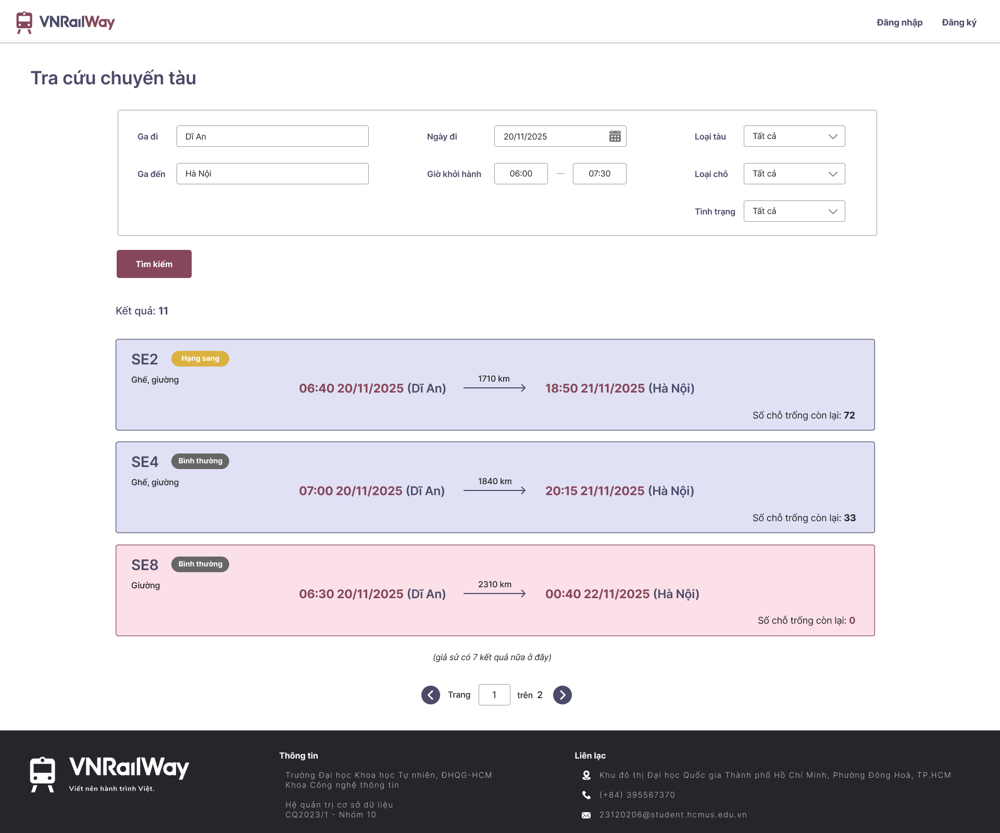

### 🎫 Interactive Seat & Berth Selection

Each trip renders its actual carriage layout. Seats already booked by others, seats the current user holds, and free seats are colour-coded per carriage, with per-seat pricing on hover.

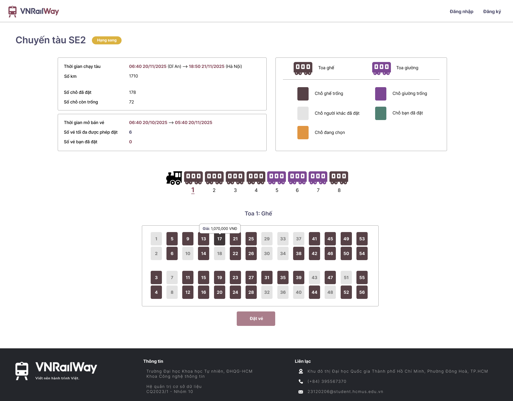

### 💳 Booking, Payment & Hold Expiry

Confirmed bookings carry a 15-minute payment window; unpaid tickets are released automatically once it lapses, so seat inventory stays accurate under concurrent bookings.

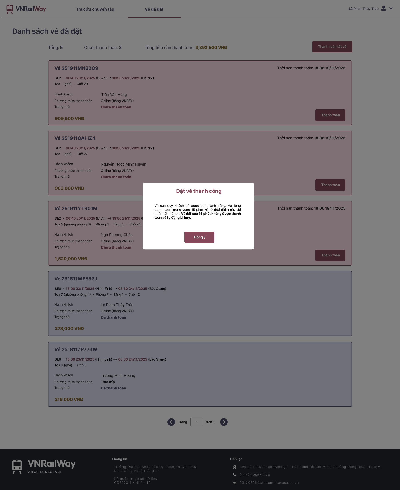

### 📊 Manager Operations & Analytics

Managers administer the fleet, routes, and trips, and track performance through revenue, trip-count, and ticket-sales charts filterable by time range and train.

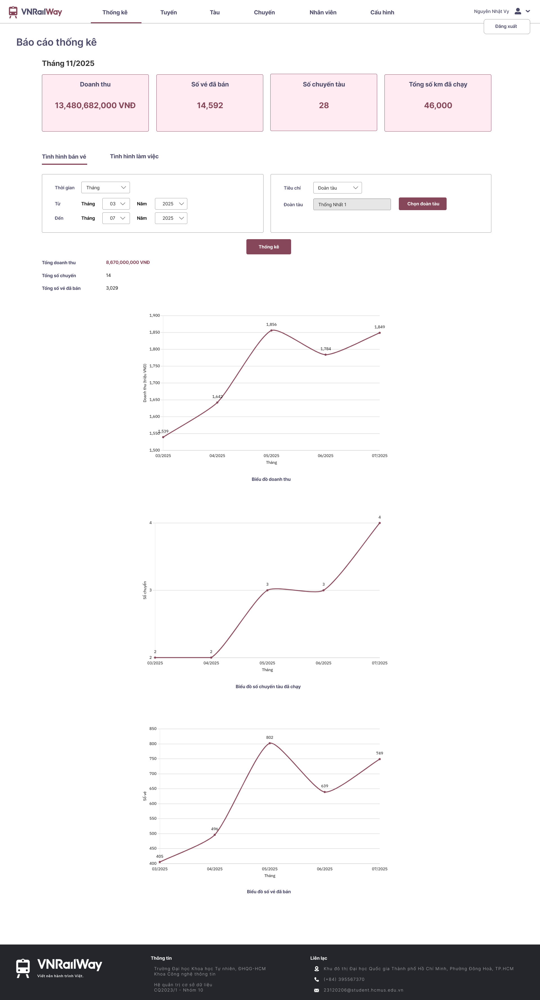

### 🧾 Ticket Seller — Counter Sales

Front-desk staff build a ticket directly from a trip's live seat map, capture passenger details, and confirm payment on the spot for walk-in customers.

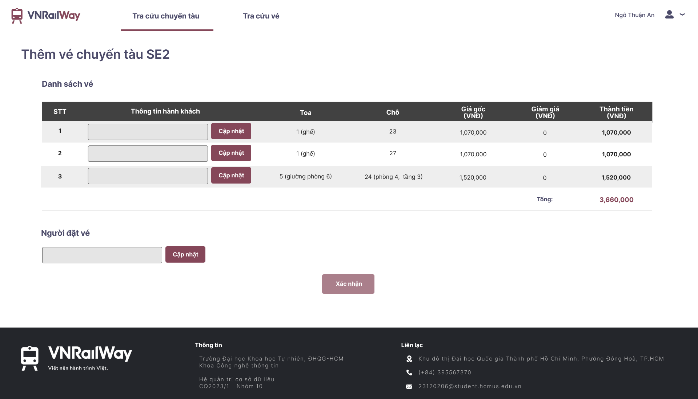

### 🛠️ Admin — Employee & Account Management

Administrators manage employee and customer accounts across the whole system — search, filter, add, edit, and review detail records.

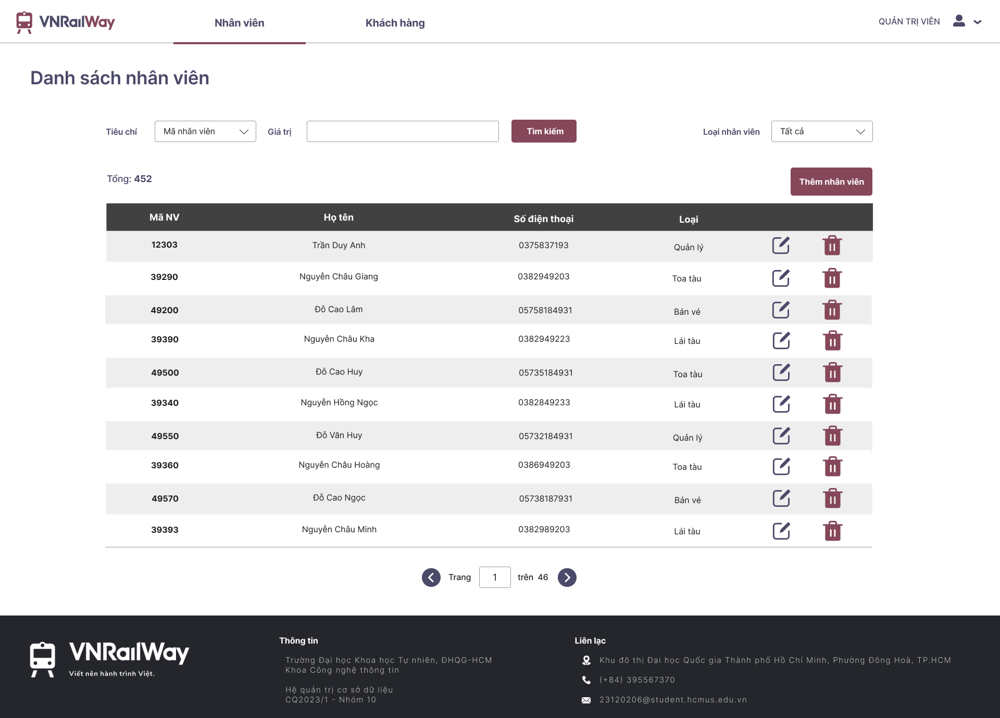

<details>
<summary>More screens (fleet management, route management, booking flow)</summary>

| | |
| :---: | :---: |
| 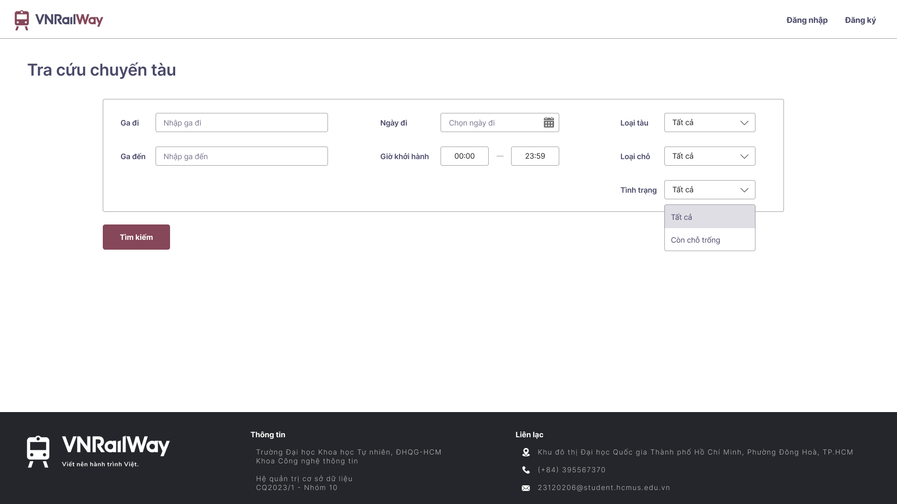 | 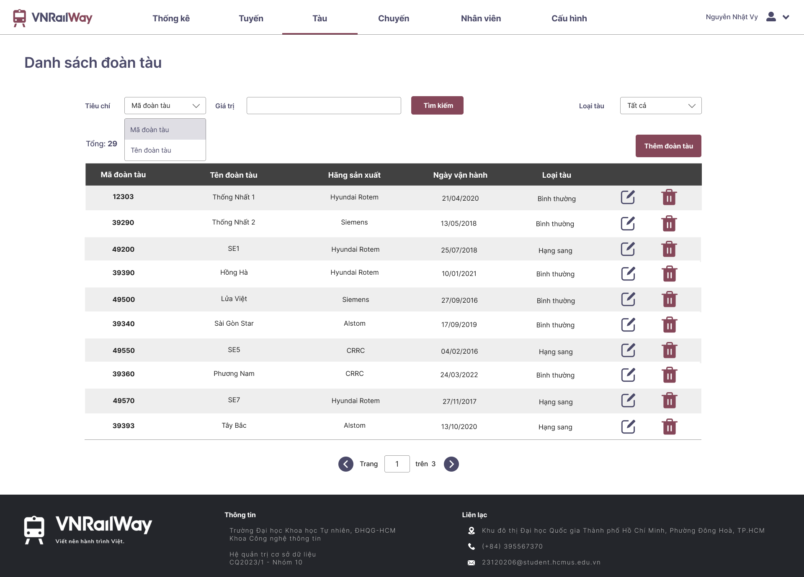 |
| 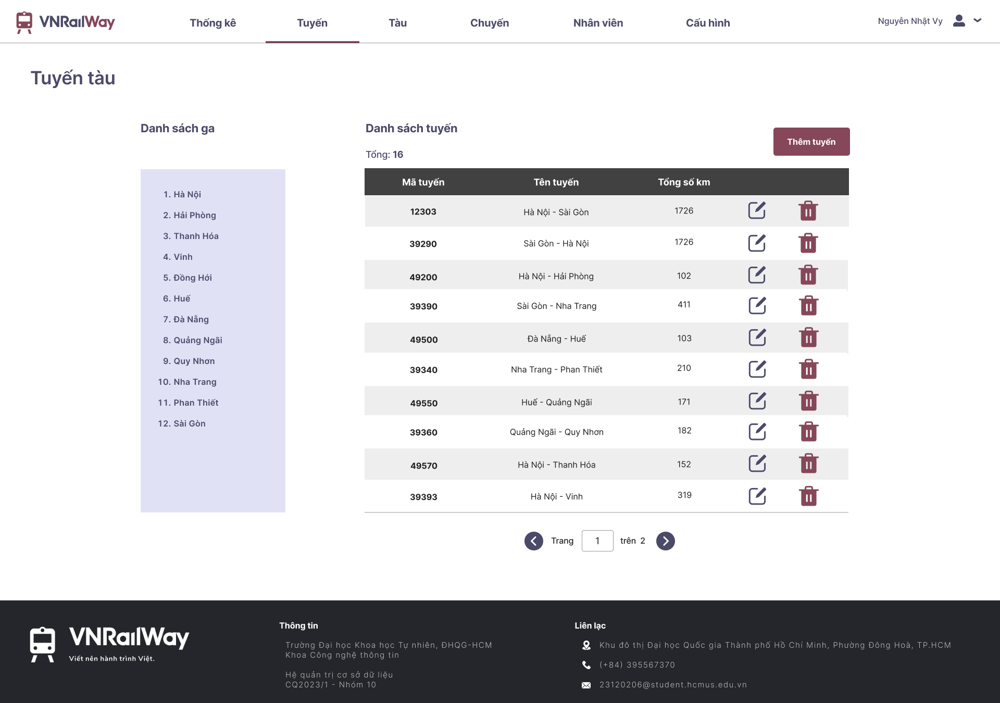 | 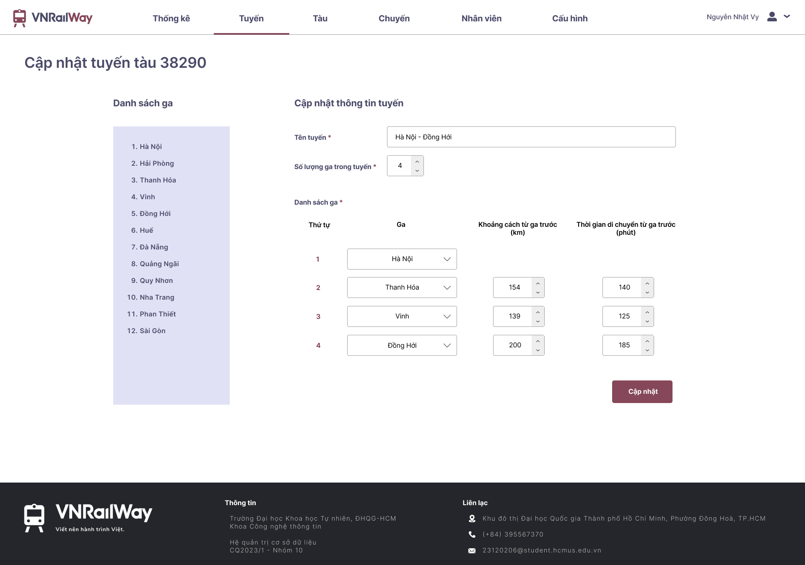 |
| 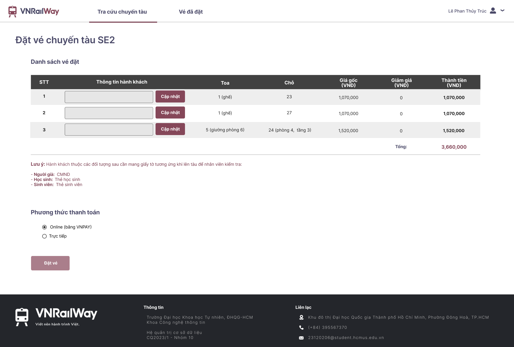 | 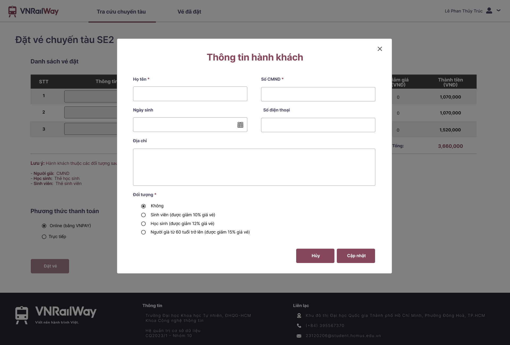 |

</details>

## License

Distributed under the MIT License. See [`LICENSE`](LICENSE) for details.

## Credits

Icons used in the UI are sourced from [Flaticon](https://www.flaticon.com):

| Asset | Author |
| :--- | :--- |
| `train.png` | Cuputo |
| `user.png` | Saepul Nahwan |
| `carriage-brown.png` / `carriage-violet.png` | Fauzi Arts |
| `update.png` | meaicon |
| `delete.png` | Nirmalraj |
| `previous-page.png` / `next-page.png` | Smashicons |
| `address.png` | Freepik |
| `phone.png` | Prosymbols |
| `mail.png` | Freepik |
| `down-arrow.png` | Freepik |
